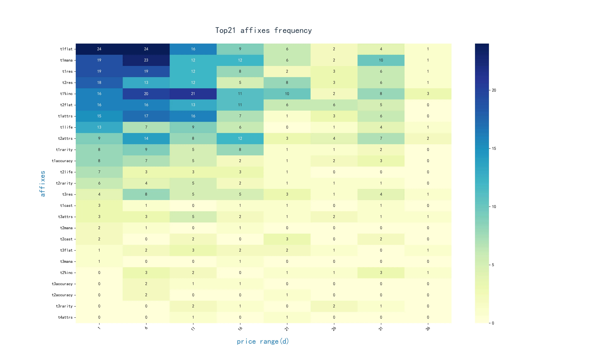
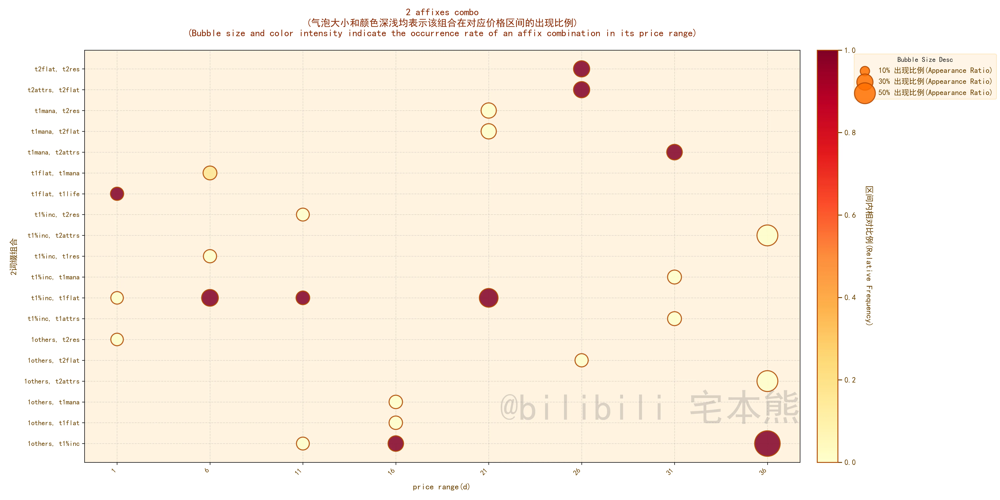
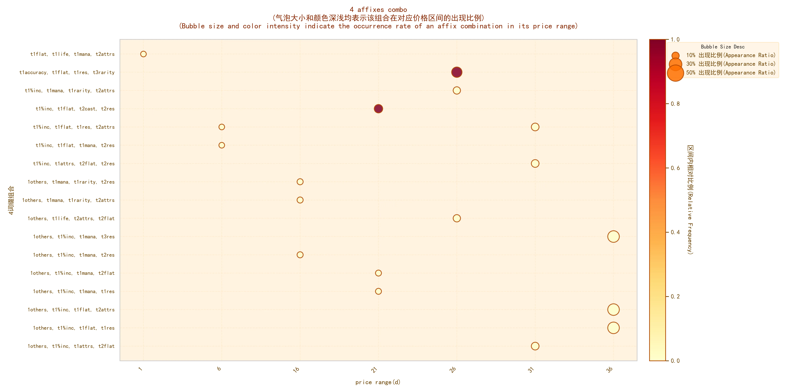

# poe2_gear_analysis

🔍 An open-source project using frequent itemset mining to discover the most valuable and meta-defining affix combinations on Path of Exile 2 gear.

---

## 🧭 Part of the Poe2 Compass Suite

This project is the core analysis engine behind **[Poe2 Compass](https://poe2fun.com)**, a comprehensive toolkit for Path of Exile 2 traders and crafters.

* **Live Application:** See the analysis in action at **[poe2fun.com/analysis](https://poe2fun.com/analysis)**
* **Main Website:** Discover all our tools at **[poe2fun.com](https://poe2fun.com)**

## ✨ Visual Showcase: What it Does

This engine processes top-tier item data to generate clear visualizations of the most valuable affix combinations, helping you understand the crafting meta at a glance.

### Heatmap (单词缀热图)


### Affix Combination Bubble Charts (多词缀组合气泡图)
**Two-Affix Combos:**


**Three-Affix Combos:**


**Four-Affix Combos:**


### Histograms (统计汇总)


## 🚀 Getting Started

To run the analysis engine locally, follow these steps:

1.  **Clone the repository:**
    ```bash
    git clone https://github.com/ItshallBe/poe2_gear_analysis.git
    cd poe2_gear_analysis
    ```

2.  **Install dependencies:**
    ```bash
    pip install -r requirements.txt
    ```

3.  **Run the main script:**
    ```bash
    python main.py
    ```

## 💻 Tech Stack

* **Python**: The primary language for data analysis.
* **Pandas**: For data manipulation and processing.
* **mlxtend**: For implementing the core frequent itemset mining algorithms (Apriori, FP-Growth). 
* **Plotly & Seaborn**: For generating visualizations.

## 🤝 Contributing

Contributions from the community are welcome! Whether it's improving the analysis algorithms, adding support for more item types, or fixing bugs, please feel free to open an issue or submit a pull request.

## 📄 License

This project is licensed under the MIT License.